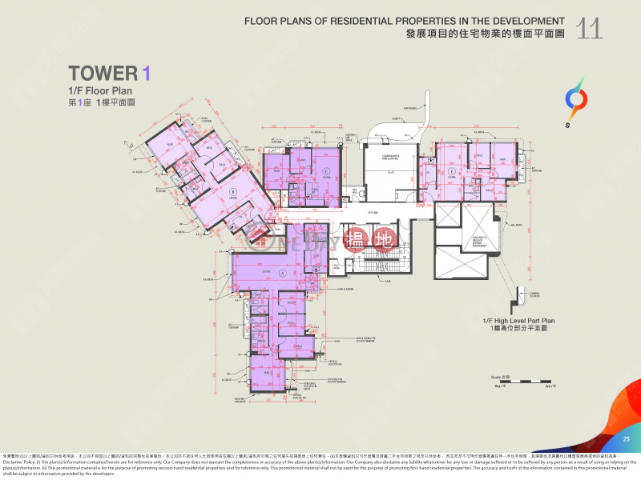

# 2D Demos

## Georeference Plat+

An enhanced version of the [Georeference Plat widget](https://www.arcgis.com/home/item.html?id=68f3890767a843c0940eb7e9840c5244) by North Point Geographic Solutions. There are four additional features: saving geoferenced floor plans and loading them on the next launch, background removal, <!--skew,--> and rotate.

### Background removal

Usually, floor plan images have a background colour which is not transparent, be it white, beige, or multi-coloured. As a result, other buildings, roads in the basemap will be occluded if the image is directly placed on the map.

For example:



(Copyright Ka Wah Properties, Free Use only)

The function will be implemented as an option.
<!--
<button>Background removal</button>

-->

```
"ImageMagick-7.1.0-portable-Q16-x64/magick.exe" convert yellowJacket.jpg -fuzz 10% -transparent White out.png
```

```
"ImageMagick-7.1.0-portable-Q16-x64/magick.exe" convert yellowJacket.jpg -fuzz 5% -fill Red -opaque White x.png
```

```
"ImageMagick-7.1.0-portable-Q16-x64/magick.exe" convert master.JPG -fuzz 5% -fill none -draw "matte 0,0 floodfill" result.png
```

### Rotation

Rotation directly modifies the image stored in Base64.