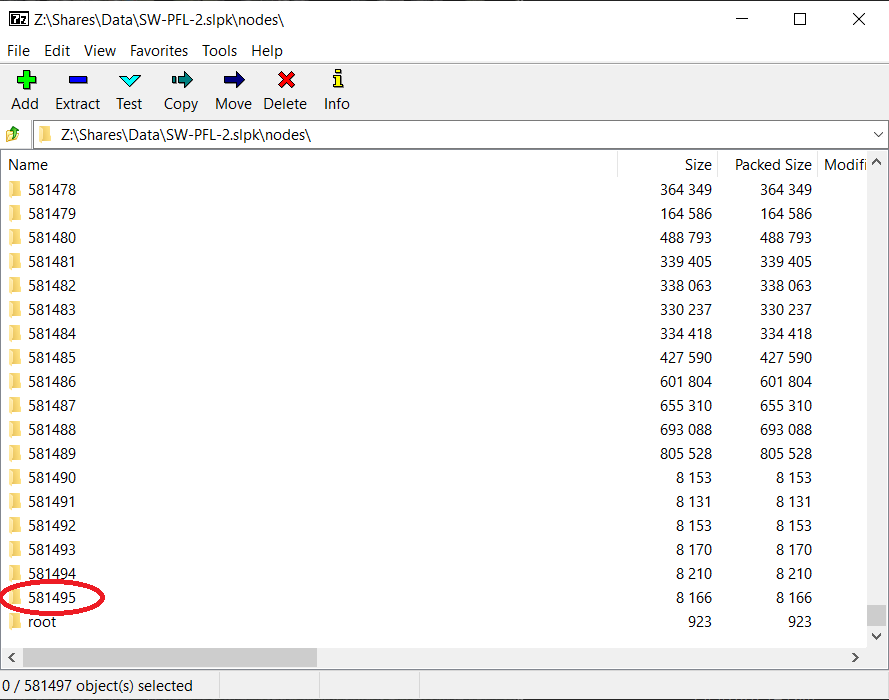
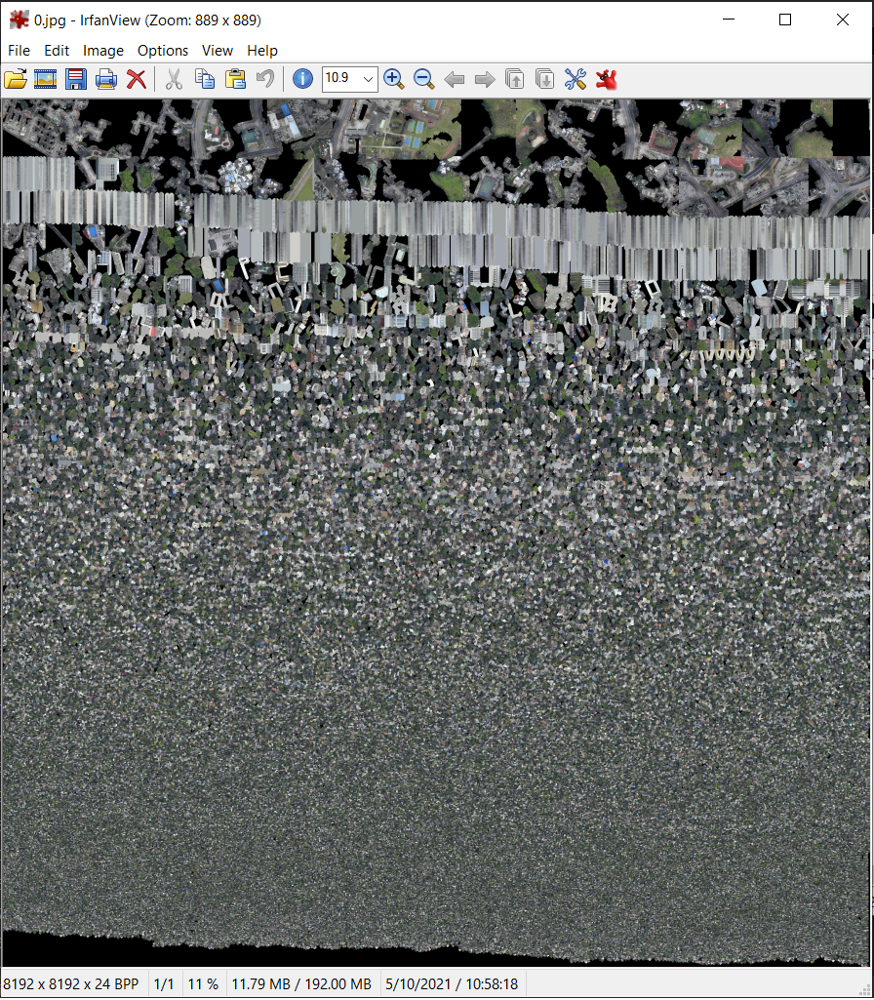

# 3D Mesh Demo

## Baking

Normally one model should have more than one material, which is suboptimal since loading the textures degrade the performance. Therefore, it is required to **UV unwrap** of each model and **texture bake** it into a single texture.

How to know if there is no baking from a SLPK file (**bad**):

One SLPK node (starts from 0) equals one material. There are 581496 materials in this 363 GB SLPK file, which is dismal.

Example of baked texture:

Additionally, you can add OSGB levels of detail (pyramid) after baking to speed up loading. Yet, the levels should be controlled so that the geometry will not be oversimplified.