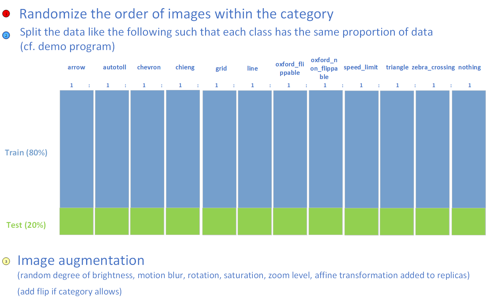

# Deep Learning Demos

## Tidying needed
See [traffic](../traffic) for the moment.

### Instructions

## Build
The deep learning libraries are archived into an NSIS installer. Install [NSIS](https://sourceforge.net/projects/nsis/) and [Firefox Portable](https://portableapps.com/apps/internet/firefox_portable) (a dependency of the `selenium-wire` library, which is used to — for instance — get the URL of a live traffic video stream) to build the software.
