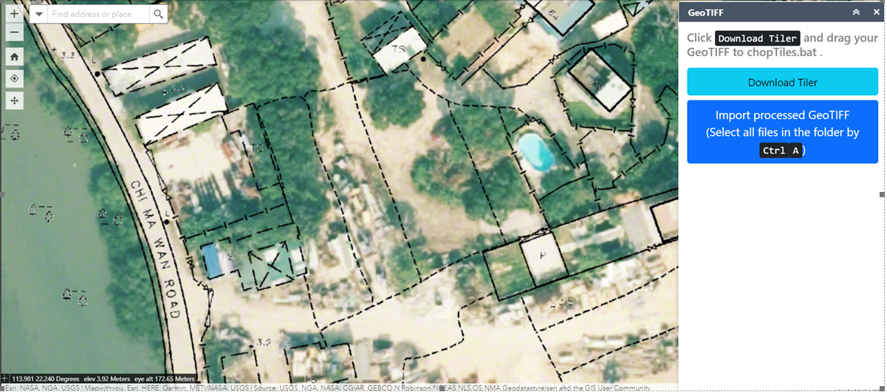
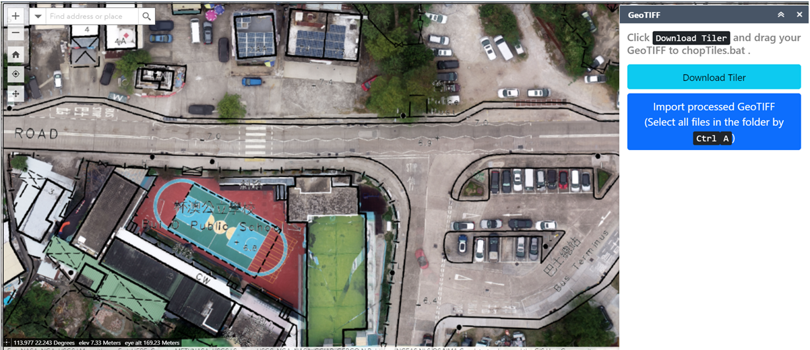

# GeoTIFF (Local)

[https://demo2.hkgisportal.com/geotiff](https://demo2.hkgisportal.com/geotiff)

A simple app to load GeoTIFF images to SceneView using `BaseTileLayer`.

The usage is simple:
1. Drag GeoTIFF Image to `chopTiles.bat` (or `chopTiles (white background to transparent).bat` to remove white background for topological maps w/ contour lines), which in turn calls `.convert/chopTiles.exe`. 256px*256px Base64-encoded WebP tiles will be created.
2. On the web app, select all the files. The FileList JavaScript data type is always sorted, so the `config.json` file (which contains layer tile, tile limits, and extent) always comes last. Under the hood, a tile file is only read when needed. The actual data will be discarded after rendering. This explains the high speed.