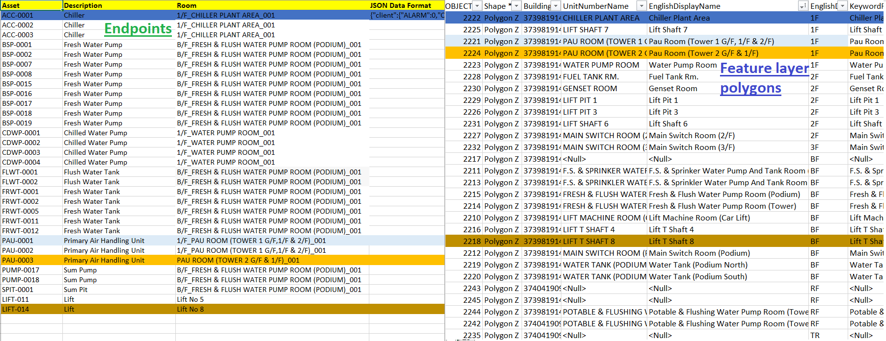
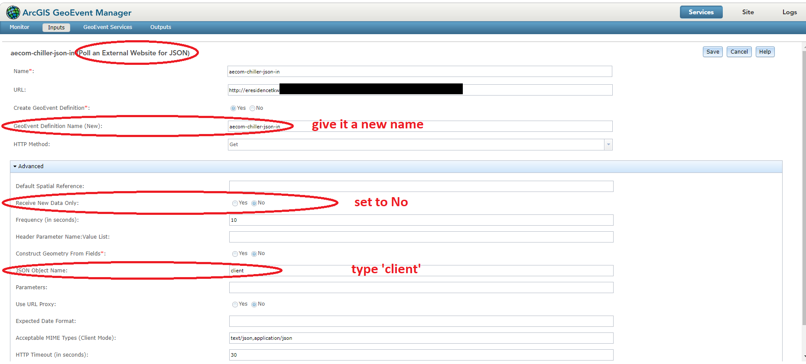

# Internet of Things Demos

## Sensors Dashboard

[https://demo2.hkgisportal.com/sensors2/](https://demo2.hkgisportal.com/sensors2/)

This is a clone of the [Coolmaps NYC Work Orders](https://coolmaps.esri.com/NYC/NYCHA/dashboard/) app, with the residential block changed to the newly-built eResidence in To Kwa Wan, Kowloon, Hong Kong. A GeoEvent Server installation is required.

Some data wrangling is needed. For example, the ArcGIS Pro geoprocessing tool **Polygon Neighbours** is used to find neighbouring units of selected flats. A ModelBuilder is made to automate data preprocessing. You can re-run the workflow using it for any other building.

## GeoEvent Sever Settings

Mapping used in the sample. For the time being only 4 endpoints (coloured) are used:

Input connector settings of GeoEvent Server used in the sample:

## Sensor Readings

To change the readings of sensors (for demonstration only), run `python `[**outside_controller.py**](outside_controller.py). No remote desktop is needed.

