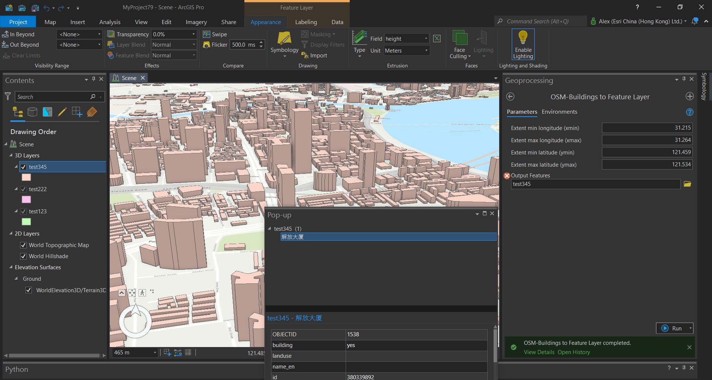

# Oriented Imagery Demos

## 360-degree Overlay

")

The panoramic image rendered using the [Three.JS](https://threejs.org/) library and is overlayed onto the `SceneView` directly. Arrows are added using the `SVGLoader` into the `ThreeJS.Scene` for navigation. A mathematical formula is used to synchronise the zoom levels of the `ThreeJS.Scene` and the `SceneView` for zooming in/out.

### Instructions
To use tools like Measurement and Line of Sight in Overlay Mode, you need to add a layer with 3D buildings to the Scene beforehand.

For Hong Kong, you may find 3D buildings from governmental organisations (e.g. HKMS 2.0, GeodataStore). For Macau and cities in mainland China (e.g. Shanghai in the second demo below), you may find shared items on ArcGIS Online from other users, or obtain the data from [https://osmbuildings.org/](OSM-Buildings). Be cautious that the coverage of OSM-Buildings is limited, and the data may have large discrepancies. 

<!-- getHeading prev, next
 -->
A custom ArcGIS geoprocessing toolbox (see figure below, [`osm_buildings_to_feature_lyr.pyt`](osm_buildings_to_feature_lyr.pyt)) is made using the [Overpass API Interpreter](https://lz4.overpass-api.de/api/interpreter) to convert OSM-Buildings into extruded features. It is not possible to directly import GeoJSON from OSM-Buildings into ArcGIS Pro, because the GeoJSON format is quite unstructured. Without a fixed schema, some records probably have missing attributes. Therefore, you should use the toolbox instead. It can get attributes such as building names.

### Caution!
Unlike point clouds, the 3D buildings do not fit into the photo perfectly since they are low-poly polyhedra with smooth, flat surfaces. In reality, building exteriors (especially roofs) are bumpy. This explains why most 3D buildings appear shorter than those in the photo.

### Demos
* [Kowloon Bay/Kai Tak, Hong Kong](https://dord.mynetgear.com/oic)
* [Hongkou District, Shanghai](https://dord.mynetgear.com/oicsh)

### Future enhancements
Calculate Intersections, Historical Panel

## Image segmentation

### Future enhancements
i18n, more models

### Demos
* [Various locations](https://dord.mynetgear.com/oiclayout)