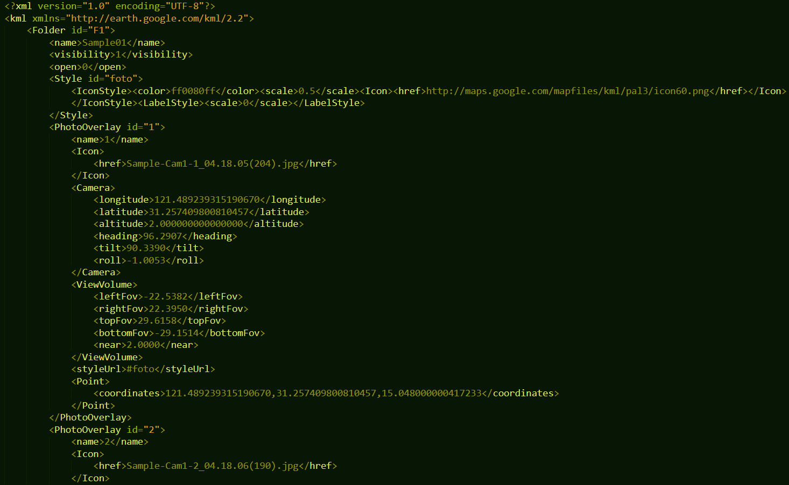

# OIC Toolbox Guide

## KML Start
It is assumed that there is a KML file with the following structure:

You have to use the [`kml_to_exif.pyt`](kml_to_exif.pyt) toolbox to propagate the EXIF metadata of images before uploading them to Internet storage.

In ArcGIS Pro, create a new **Scene** if you have not done it. 

1. In the **Insert** tab of ArcGIS Pro, click **Toolbox** > **Add Toolbox**.

## Riegl Start
...

[Continue the guide](.)