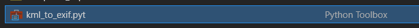
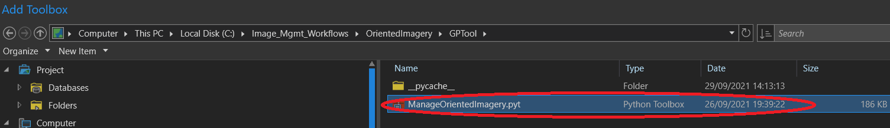
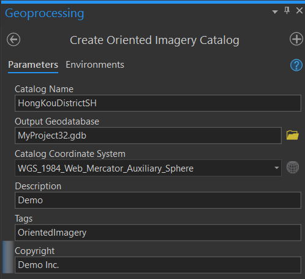
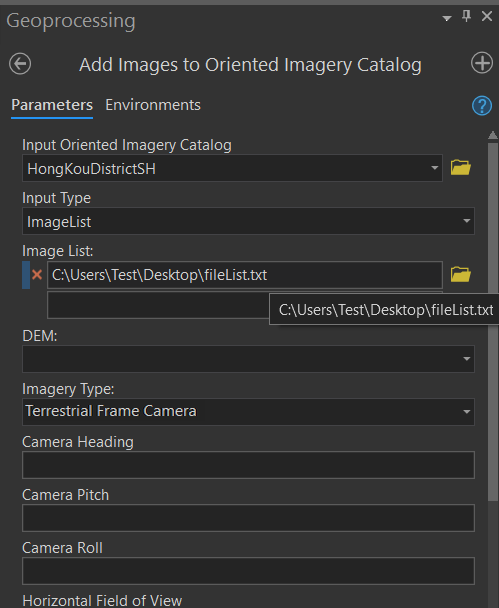
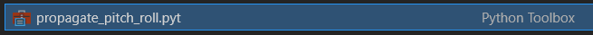
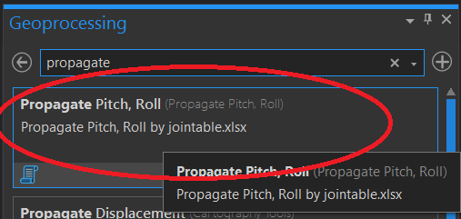

# OIC Toolbox Guide

* [KML Start](#kml-start)
* [Riegl Start](#riegl-start)

## KML Start
It is assumed that there is a KML file with the following structure:

You have to use the [`kml_to_exif.pyt`](kml_to_exif.pyt) toolbox to propagate the EXIF metadata of images before uploading them to Internet storage.

In ArcGIS Pro, create a new **Scene** if you have not done it. 

1. In the **Insert** tab of ArcGIS Pro, click **Toolbox** > **Add Toolbox**.

2. Select **kml_to_exif.pyt**.

3. In the Geoprocessing panel, search *exif*.

4. In the toolbox tab, click **Browse...** under **KML File**.

5. If you see the success message below, you can now **move your images into an Internet storage**.

6. **After the move is done**, prepare a list of URLs of those images. You may copy the output of the command `for %f in ("*.jpg","*.jpeg","*.png") do @echo %f` on a regular Windows command prompt on your Windows server.

7. In the **Insert** tab of ArcGIS Pro, click **Toolbox** > **Add Toolbox**.

8. Select **C:\Image_Mgmt_Workflows\OrientedImagery\GPTool\ManageOrientedImagery.pyt**.

9. Run the **Create Oriented Imagery Catalog** tool like below:

10. Run the **Add Images to Oriented Imagery Catalog** tool like below. For Input Type, select **ImageList** and browse to the txt file you have created in Step 6. For Imagery Type, choose **Terrestrial Frame Camera**. Remove all default values starting from the Camera Heading text field.

11. In the **Insert** tab of ArcGIS Pro, click **Toolbox** > **Add Toolbox**.

12. Select **propagate_pitch_roll.pyt**.

13. Choose the **jointable.xlsx** created from Step 4. It should be in the same folder of your KML file.

## Riegl Start
...

[Continue the guide](.)