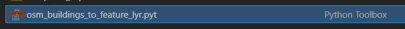

# OSM-Buildings Toolbox Guide

In ArcGIS Pro, create a new **Scene**. 

1. In the **Insert** tab of ArcGIS Pro, click **Toolbox** > **Add Toolbox**.

2. Select **osm_building_to_feature_lyr.pyt**.

3. In the Geoprocessing panel, search *osm*.

4. Enter the **Extent min longitude (xmin)**, **Extent max longitude (xmax)**, **Extent min latitude (ymin)** and **Extent max latitude (ymax)**. These data can be found at the bottom of the scene.

5. In the toolbox tab, click **Browse...** under **Output Features**.

6. Navigate to **Database**, and double click on the current geodatabase.

7. Name the output layer, and click **Save**.

8. After the execution succeeded, in the **Contents Tab**, right click on the output feature layer, then click on **Properties**.

9. On the left, click on **Elevation**, and choose **On the ground** from the drop-down menu.

10. Left click on the output feature layer.

11. In the **Appearance** tab, click **Type** and select **Base Height**. For **Field**, choose **height** from the drop-down menu.

12. In the **Contents Tab**, right click on **Scene**, then click on **Properties**.

13. On the left, click on **Coordinates System**, search *3857*, and select **WGS 1984 Web Mercator (auxiliary sphere)**.

14. After the execution succeeded, in the **Share** tab, click **Web Scene**.

15. Make sure the scene contains no unwanted items. Fill in the details, and click **Share**.

16. After sharing succeeded, click **Manage the shared layer**. A browser window will open.

17. On the Scene Viewer page, click the button next to uploaded layer, then click **Layer Properties**.

18. Change the colour and transparency of the blocks.

19. Customise the layer as below:

[Continue the guide](.)