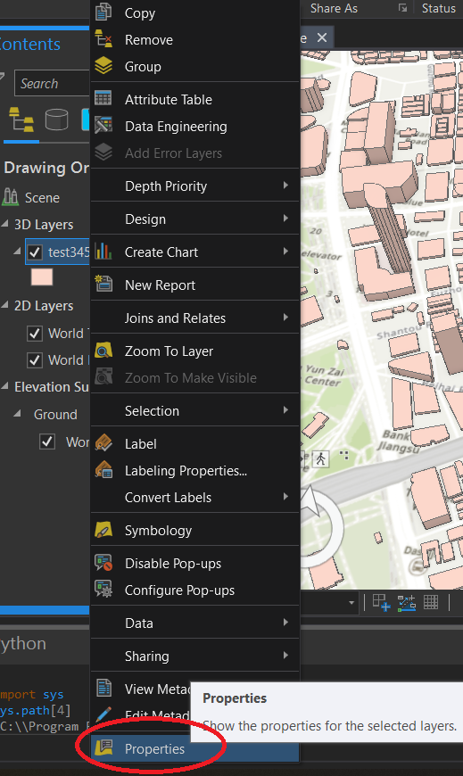

# OSM Toolbox Guide

In ArcGIS Pro, create a new **Scene**. 

1. In the **Insert** tab of ArcGIS Pro, click **Toolbox** > **Add Toolbox**.

2. Select **osm_building_to_feature_lyr.pyt**.

3. In the Geoprocessing panel, search **osm**.

4. Enter the **Extent min longitude (xmin)**, **Extent max longitude (xmax)**, **Extent min latitude (ymin)** and **Extent max latitude (ymax)**. These data can be found at the bottom of the scene.

5. In the toolbox tab, click **Browse...** under **Output Features**.

6. Navigate to **Database**, and double click on the current geodatabase.

7. Name the output layer, and click **Save**.

8. After the execution succeeded, in the **Share** tab, click **Web Scene**.

9. After sharing succeeded, click **Manage the shared layer**. A browser window will open.