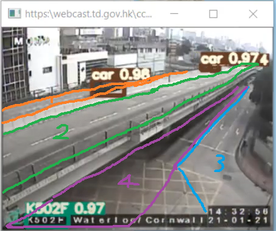

# Traffic Demos

## 1. Car count using the YOLOv3 library from [`arcgis.learn`](https://developers.arcgis.com/python/api-reference/arcgis.learn.toc.html)

[](https://www.youtube.com/watch?v=dG4d191XsqU "Live Traffic View Using Object Detection & GeoEvent Server")

The Python tool leverages the open-source YOLOv3 convolutional neural network (CNN) library bundled in the [`arcgis.learn` Python library](https://developers.arcgis.com/python/api-reference/arcgis.learn.toc.html). The neural network is designed for fast object detection.

### Instructions
For the detection to be useful, some work needs to be done beforehand. First, run the script and a GUI will open. Open a reference image, draw the polygons for each traffic lane, and the tool will turn them into pixel coordinates (masks).

  

  


| Camera code     | Traffic lane | Mapping       |
|-----------------|--------------|---------------|
| H106F | 1 | Connaught Rd Central near Exchange Square |
| H109F | 1 | Garden Road Flyover towards Cotton Tree Drive |
| H109F | 2 | Queensway heading towards Queen's Road Central |
| H207F | 1 | Cross Harbour Tunnel Hong Kong Side |
| H210F | 1 | Aberdeen Tunnel - Wan Chai Side (entering, southwards) |
| H210F | 2 | Aberdeen Tunnel - Wan Chai Side (exiting, northwards) |
| H210F | 3 | Wong Nai Chung Road / Queen's Road East |
| H801F | 1 | Island Eastern Corridor near Ka Wah Center towards Central / Causeway Bay (westwards) |
| H801F | 2 | Island Eastern Corridor near Ka Wah Center towards Eastern Harbour Crossing (eastwards) |
| H801F | 3 | Island Eastern Corridor near Ka Wah Center towards Shau Kei Wan / Chai Wan (eastwards) |
| K107F | 1 | Cross Harbour Tunnel Kownloon Side (exiting, northwards) |
| K107F | 2 | Cross Harbour Tunnel Kownloon Side (entering, southwards) |
| K109F | 1 | Chatham Road S near Prince Margaret Road (eastwards) |
| K109F | 2 | Chatham Road S near Prince Margaret Road towards West Kowloon Corridor (westwards) |
| K409F | 1 | Princess Margaret Road near Argyle Street |
| K409F | 2 | Argyle Street Flyover near Princess Margaret Road (eastwards) |
| K409F | 3 | Argyle Street Flyover near Princess Margaret Road (westwards) |
| K502F | 1 | Waterloo Road Flyover (southwards) |
| K502F | 2 | Waterloo Road Flyover towards Lion Rock Tunnel (northwards) |
| K502F | 3 | Waterloo Road towards Cornwall Street (northwards) |
| K502F | 4 | Waterloo Road (northwards) |
| K614F | 1 | Clear Water Bay Road (eastwards) |
| K614F | 2 | Clear Water Bay Road towards Lung Cheung Road (westwards) |


<!-- lat	lng	TR119F Tuen Mun Road - Sam Shing Hui
lat	lng	TR116F Tuen Mun Road - Siu Lam Section
lat	lng	TR107F Tuen Mun Road - Sham Tseng Section
lat	lng	TR103F Tuen Mun Road - Yau Kom Tau Section
lat	lng	TR101F Tuen Mun Road - Chai Wan Kok
lat	lng	
lat	lng	TW103F Tsuen Wan Road near Tsuen Tsing Intchg
lat	lng	TW105F Kwai Tsing Road near Tsing Yi Bridge
lat	lng	TW102F Kwai Chung Road near Container Terminal
lat	lng	TW117F Castle Peak Road near Texaco Road North
lat	lng	TW120F Tsuen Wan Road near Tai Chung Road -->

**The polygon masks (2D NumPy array of True/False) have been pickled to a single file.** For each recognition, the Python tool tests whether the centres of the bounding boxes are inside each polygon, and updates the Feature Layer according to the camera code detected and vehicle position (traffic lane).

### Future enhancements

Stream output video to a webpage for visualisation

## 2. TomTom Traffic Data

[](https://www.youtube.com/watch?v=RaSymtkdyhA "TomTom traffic layer updates every 0.5 minutes (that’s the limit)")

See [`tomtom_intermediate_traffic.py`](tomtom_intermediate_traffic.py). The script pushes live traffic data to ArcGIS Online every half minute. Enter your own ArcGIS login credentials and TomTom Intermediate Traffic API Key into the file.

To install the dependencies, enter the following in the command line:
```
pip3 install -r requirements.txt
```

### Future enhancements

Handle speeds of finer sections

## 3. Traffic Emulation

This is for demo only: [https://demo2.hkgisportal.com/traffic_simulation/](https://demo2.hkgisportal.com/traffic_simulation/)

### Instructions

Gather the 3D models you want to use, normally one model should have more than one material, which is suboptimal since loading the textures degrade the performance. Therefore, it is required to **UV unwrap** each model and **texture bake** it into a small texture (e.g. 256 px * 256 px). For lights, use **combined bake** instead of texture bake. Export all models into GLB which is the only supported format (except raw glTF). You may use the open-source software Blender to complete this task: [Official Guide from Esri](https://www.esri.com/arcgis-blog/products/arcgis/3d-gis/gis-visualization-and-storytelling-in-3d/)

### Future enhancements

More open-box options, highlight peak hours <!--, people left in queues, flying bus bug-->

### Common Questions

* How is the data historical traffic data collected?

The TomTom Traffic API is queried every half minute. The collected data is then grouped by road segment, date of week and the 10-minute time frame, in order to obtain the average speeds.

* Which time period is the historical traffic data collected?

We are at an early stage. We have been collecting data from TomTom since mid-August.
Where is the historical traffic data stored?
The data is hosted on ArcGIS Online as a Table Service.

* What is the algorithm in a nutshell?

There is a single **for-loop** to render the graphics that updates every 1 / frame-per-rate seconds. The displacement distances of each frame are calculated by the formulae: S = D / T; Dsegment = { [S * (1/60/60)] * 1000 } metres; Dframe = (Dsegment / fps) metres.

* How did you obatain the mesh model?

The mesh model is mostly customly made. A portion of the model is taken from the Lands Department.
